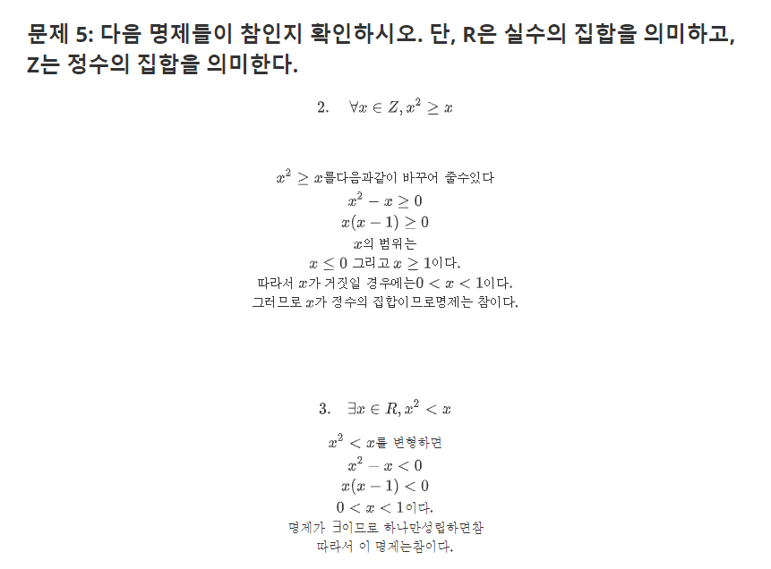
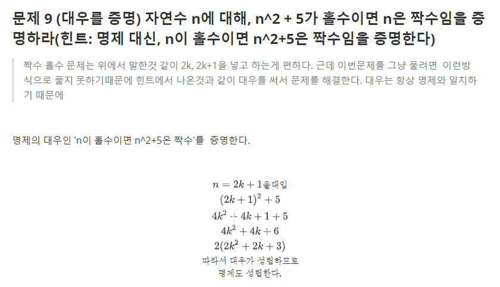
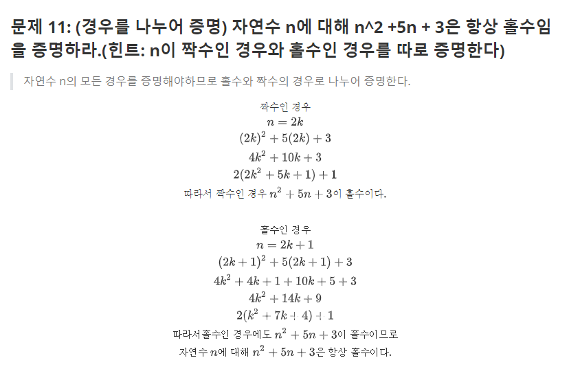
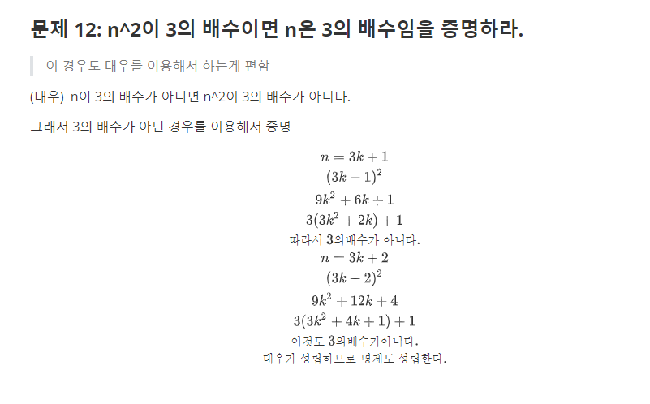
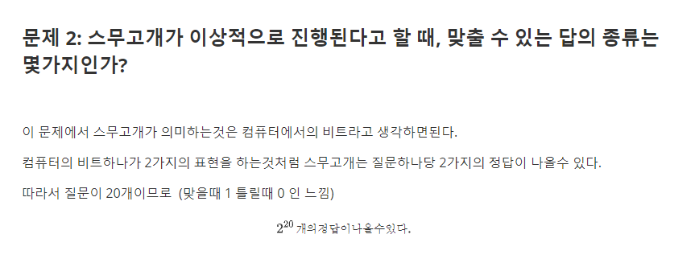
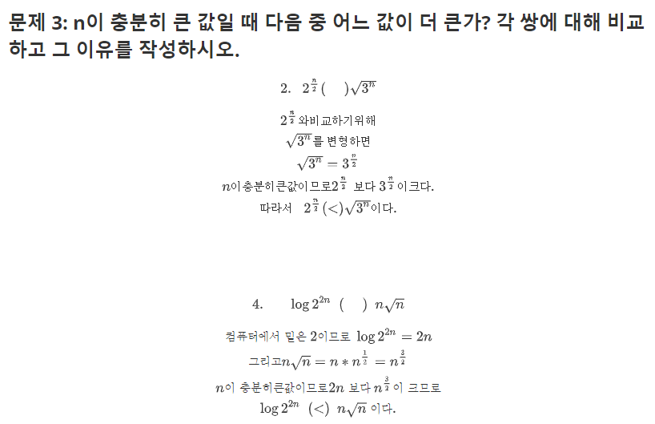
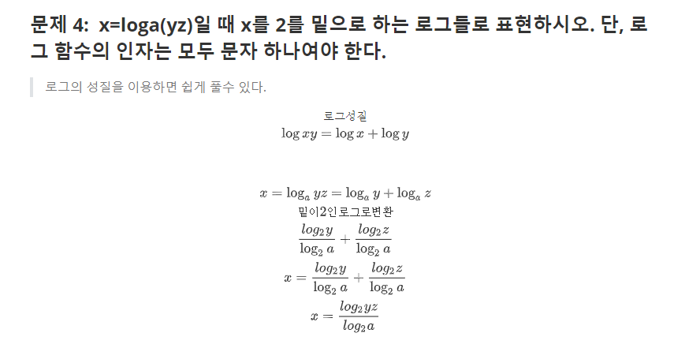
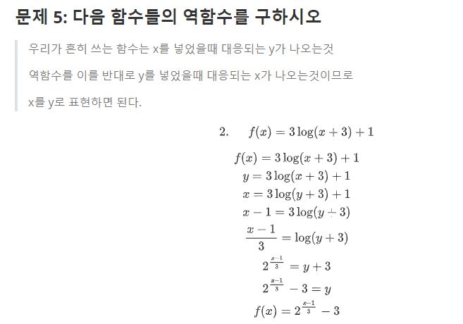
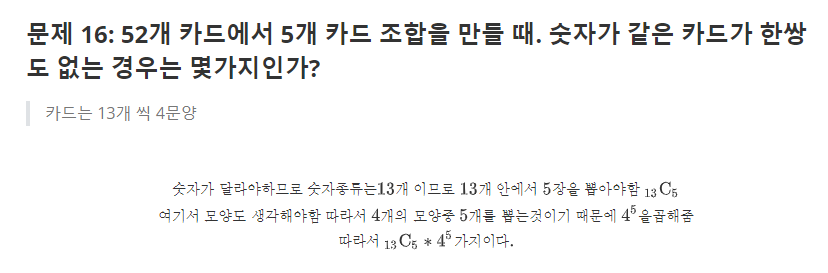
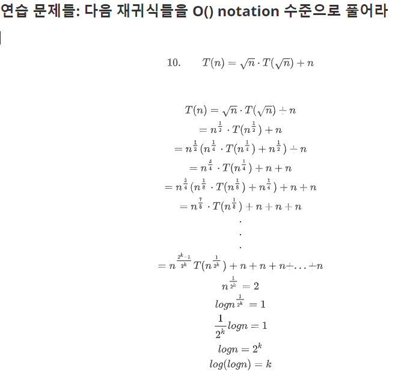

# 1. 논리와 증명


동등하지 않음














# 2. 수와 표현














# 3. 집합과 조합론





# 4. 기초 수식





# 5. 재귀


### 문제 6: 루트 있는 트리를 입력으로 받아 아래와 같이 출력하는 알고리즘을 작성하라. 트리의 각 노드에는 1000 미만의 자연수가 저장되어 있다. 트리의 노드 연결 관계는 다음과 같이 표현해야 한다. 아래 출력에서 루트에는 자식이 3개 있고 그 자식들 중 하나는 더 이상 자식이 없는 것임을 알 수 있을 것이다.

 


# 6.  동적 프로그래밍


```python
# A, B행렬이 있다고 생각했을때
for i in range(b):
    for j in range(b):
        for k in range(b):
            A[i,k] * B[k, j]
   
```

