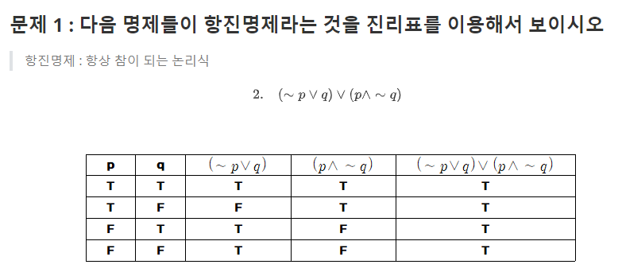

```
<script type="text/javascript" src="http://cdn.mathjax.org/mathjax/latest/MathJax.js?config=default"></script>
```

```

```

# 1. 논리와 증명


### 문제 1 : 다음 명제들이 항진명제라는 것을 진리표를 이용해서 보이시오

>  항진명제 : 항상 참이 되는 논리식

$$
2.\ \ \ \ ( \sim p\or q) \or (p \and \sim q)
$$





### 문제 2 : 다음 명제들이 모순명제라는 것을 진리표를 이용해서 보이시오

> 모순명제 : 항상 거짓의 값을 가지는 논리식

$$
2. (p \and q) \and(p \and \sim q)
$$


### 문제 3 : 다음 명제의 쌍 들에 대해서 두 명제가 동등한지를 진리표를 이용해 확인하시오

$$
2.  \ \ \sim p \or \sim q 와 \sim(p \or q)
$$


동등하지 않음
$$
\sim (p \or q) \ \ 
를 변형하면 \ \ \ (\sim p \and \sim q)
$$


### 문제 4: 명제식의 변형을  통해여 다음 명제를 간소화하시오

$$
2. \ \ \ (p \or \sim q) \and (\sim p \or \sim q)
$$


$$
\ \ \ (p \or \sim q) \and (\sim p \or \sim q) 식에서  \sim q가 \ 겹치는것을 \ 볼수\ 있음
\\ 따라서 \ (p \and \sim p)\or \sim q 이렇게 \ 변형할 \ 수 \ 있음

\\ 당연히 \ (p \and \sim p) 거짓이므로 
\\ (p \and \sim p)\or \sim q는 \ \ \ \ \sim q이다
$$


### 문제 5: 다음 명제들이 참인지 확인하시오. 단, R은 실수의 집합을 의미하고, Z는 정수의 집합을 의미한다.


$$
2. \ \ \ \ \ \forall x \in Z, x^2 \ge x
$$


$$
x^2 \ge x 를 다음과 같이\ 바꾸어\ 줄수있다
\\ x^2-x \ge 0
\\x(x-1) \ge 0
\\ x의  \ 범위는
\\ x \le 0  \ 그리고  \ x \ge 1 이다.
\\ 따라서 \ x가 \ 거짓일 \ 경우에는 0 < x < 1 이다.
\\ 그러므로 \ x가 \ 정수의 \ 집합이므로 명제는 \ 참이다.
$$


$$
3. \ \ \ \ \exists x \in R, x^2 < x
$$

$$
x^2 < x 를 \ 변형하면 
\\ x^2 -x<0
\\ x(x-1)<0
\\ 0<x<1 이다.
\\ 명제가  \ \ \exist이므로 \ 하나만 성립하면 참
\\ 따라서 \ 이 \ 명제는 참이다.
$$


### 문제 7: n이 홀수이면 n^2 + n은 짝수임을 증명하라.

> 홀수 짝수 문제나오면 홀수일때는 2k+1 짝수일때는 2k 로 대입하면 문제 거의다 풀림


$$
n이 홀수이므로 \ n=2k를\ 대입하면
\\ (2k)^2 +2k
\\4k^2 +2k
\\ 2(2k^2+k)
\\ 따라서 \ n^2 + n 은\ 짝수이다.
$$


### 문제 9 (대우를 증명) 자연수 n에 대해, n^2 + 5가 홀수이면 n은 짝수임을 증명하라(힌트: 명제 대신, n이 홀수이면 n^2+5은 짝수임을 증명한다)

> 짝수 홀수 문제는 위에서 말한것 같이 2k, 2k+1을 넣고 하는게 편하다. 근데 이번문제를 그냥 풀려면  이런방식으로 풀지 못하기때문에 힌트에서 나온것과 같이 대우를 써서 문제를 해결한다. 대우는 항상 명제와 일치하기 때문에


명제의 대우인 'n이 홀수이면 n^2+5은 짝수'를  증명한다.


$$
n =2k+1을 대입
\\ (2k+1)^2 + 5
\\ 4k^2+4k+1+5
\\4k^2+4k+6
\\2(2k^2+2k+3)
\\따라서 \ 대우가 \ 성립하므로 
\\명제도 \ 성립한다.
$$


### 문제 11: (경우를 나누어 증명) 자연수 n에 대해 n^2 +5n + 3은 항상 홀수임을 증명하라.(힌트: n이 짝수인 경우와 홀수인 경우를 따로 증명한다)

> 자연수 n의 모든 경우를 증명해야하므로 홀수와 짝수의 경우로 나누어 증명한다. 


$$
짝수인 \ 경우
\\ n=2k
\\ (2k)^2+5(2k)+3
\\4k^2+10k+3
\\2(2k^2+5k+1)+1
\\따라서 \ 짝수인 \ 경우 \ n^2 + 5n + 3이\ 홀수이다.
\\
$$

$$
홀수인 \ 경우
\\n=2k+1
\\(2k+1)^2+5(2k+1)+3
\\4k^2+4k+1+10k+5+3
\\4k^2+14k+9
\\2(k^2+7k+4)+1
\\따라서 홀수인 \ 경우에도 \ n^2+5n+3이 \ 홀수이므로
\\자연수 \ n에 \ 대해 \ n^2+5n+3은 \ 항상 \ 홀수이다.
$$


### 문제 12: n^2이 3의 배수이면 n은 3의 배수임을 증명하라.

> 이 경우도 대우를 이용해서 하는게 편함

(대우)  n이 3의 배수가 아니면 n^2이 3의 배수가 아니다.

그래서 3의 배수가 아닌 경우를 이용해서 증명


$$
n=3k+1
\\(3k+1)^2
\\9k^2+6k+1
\\3(3k^2+2k)+1
\\따라서  \ 3의 배수가 \ 아니다.
\\n=3k+2
\\(3k+2)^2
\\9k^2+12k+4
\\3(3k^2+4k+1)+1
\\이것도 \ 3의 배수가 아니다.
\\ 대우가 \ 성립하므로 \ 명제도 \ 성립한다.
$$


# 2. 수와 표현


### 문제 2: 스무고개가 이상적으로 진행된다고 할 때, 맞출 수 있는 답의 종류는 몇가지인가?


이 문제에서 스무고개가 의미하는것은 컴퓨터에서의 비트라고 생각하면된다. 

컴퓨터의 비트하나가 2가지의 표현을 하는것처럼 스무고개는 질문하나당 2가지의 정답이 나올수 있다.

따라서 질문이 20개이므로  (맞을때 1 틀릴때 0 인 느낌)
$$
2^{20} 개의 정답이 나올수 있다.
$$


### 문제 3: n이 충분히 큰 값일 때 다음 중 어느 값이 더 큰가? 각 쌍에 대해 비교하고 그 이유를 작성하시오.

$$
2. \ \ \ 2^{ {n \over 2} }  (\ \ \ \ \ ) \sqrt{3^n}
$$


$$
2^{ {n \over 2} }와 비교하기 위해
\\ \sqrt{3^n}를 \ 변형하면
\\ \sqrt{3^n} =3^{n \over 2}
\\ n이 충분히 큰 값이므로  2^{ {n \over 2} }  \ 보다 \  3^{n \over 2}이 크다.
\\따라서 \ \ \ 2^{ {n \over 2} }  (<) \sqrt{3^n}이다.
$$


$$
4. \ \ \ \ \ \ \ \log2^{2n} \ \ (\ \ \ \ \ ) \ \ n\sqrt{n}
$$

$$
컴퓨터에서 \ 밑은 \ 2이므로 \ \log2^{2n} = 2n
\\ 그리고 n\sqrt{n} = n*n^{1 \over 2} = n^{3 \over 2} 
\\ n이 \ 충분히 큰 값이므로 2n \ 보다 \ n^{3 \over 2} 이 \ 크므로
\\ \log2^{2n} \ \ (< ) \ \ n\sqrt{n} \ 이다.
$$


### 문제 4:  x=loga(yz)일 때 x를 2를 밑으로 하는 로그들로 표현하시오. 단, 로그 함수의 인자는 모두 문자 하나여야 한다.

> 로그의 성질을 이용하면 쉽게 풀수 있다.

$$
로그 성질
\\\log xy = \log x+\log y
$$


$$
x=\log_a{yz}=\log_ay+\log_az
\\밑이 2인 로그로 변환
\\ {log_2y \over \log_2a }+ {log_2z \over \log_2a }
\\  x = {log_2y \over \log_2a }+ {log_2z \over \log_2a }
\\ x= {log_2yz \over log_2a}
$$


### 문제 5: 다음 함수들의 역함수를 구하시오 

> 우리가 흔히 쓰는 함수는 x를 넣었을때 대응되는 y가 나오는것
>
> 역함수를 이를 반대로 y를 넣었을때 대응되는 x가 나오는것이므로
>
> x를 y로 표현하면 된다.


$$
2. \ \ \ \ \ \ f(x)=3\log(x+3) +1
$$

$$
f(x)=3\log(x+3) +1
\\ y=3\log(x+3) +1
\\ x=3\log(y+3) +1
\\ x-1=3\log(y+3)
\\ {x-1 \over 3}=\log(y+3)
\\ 2^{x-1 \over 3} = y+3
\\ 2^{x-1 \over 3}-3 = y
\\ f(x) = 2^{x-1 \over 3}-3
$$


# 3. 집합과 조합론


### 문제 3: 위의 결과를 이용해서 n개의 원소를 가진 집합의 가능한 부분집합의 종류는 2^n 개임을 증명하라


### 문제 16: 52개 카드에서 5개 카드 조합을 만들 때. 숫자가 같은 카드가 한쌍도 없는 경우는 몇가지인가?

> 카드는 13개 씩 4문양


$$
\\ 숫자가 \ 달라야하므로 \ 숫자 종류는 13개 \ 이므로  \ 13개 \ 안에서 \ 5장을\  뽑아야함 \ _{13}\mathrm{C}_{5} 
\\ 여기서 \ 모양도 \ 생각해야함 \ 따라서 \ 4개의 \ 모양중 \ 5개를 \ 뽑는것이기\  때문에 \ 4^5 을 곱해줌
\\ 따라서 \ _{13}\mathrm{C}_{5} *4^5 가지 이다.
$$


# 4. 기초 수식


### 연습 문제들: 다음 재귀식들을 O() notation 수준으로 풀어라

### 

$$
10. \ \ \ \ \ \ \ \ T(n)= \sqrt{n} \cdot T(\sqrt{n})+n
$$


$$
T(n)= \sqrt{n} \cdot T(\sqrt{n})+n
 \\=n^{1 \over 2}\cdot T(n^{1 \over 2}) +n
 \\=n^{1 \over 2}(n^{1 \over 4} \cdot T(n^{1 \over 4})+n^{1 \over 2})+n
 \\=n^{3 \over 4}\cdot T(n^{1 \over 4})+n+n
 \\= n^{3 \over 4}(n^{1 \over 8}\cdot T(n^{1 \over 8})+n^{1 \over 4})+n+n
 \\=n^{7 \over 8}\cdot T(n^{1 \over 8})+n+n+n
 \\.
 \\.
 \\.
 \\= n^{2^k-1 \over 2^k}T(n^{1 \over 2^k})+n+n+n+...+n
 \\n^{1 \over 2^k}=2 
 \\ logn^{1 \over 2^k}=1
 \\ {1 \over 2^k}logn = 1
 \\ logn = 2^k
 \\ log(logn) = k

  \\
$$


# 5. 재귀


### 문제 6: 루트 있는 트리를 입력으로 받아 아래와 같이 출력하는 알고리즘을 작성하라. 트리의 각 노드에는 1000 미만의 자연수가 저장되어 있다. 트리의 노드 연결 관계는 다음과 같이 표현해야 한다. 아래 출력에서 루트에는 자식이 3개 있고 그 자식들 중 하나는 더 이상 자식이 없는 것임을 알 수 있을 것이다.

 


# 6.  동적 프로그래밍

