# 1. 논리와 증명


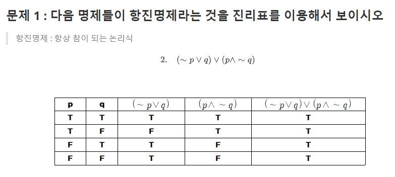


동등하지 않음


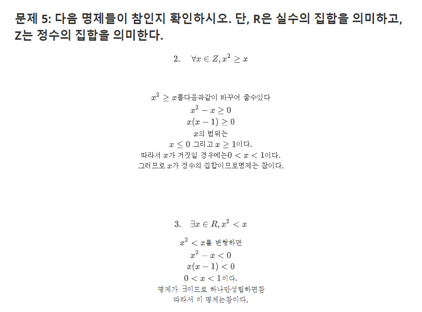


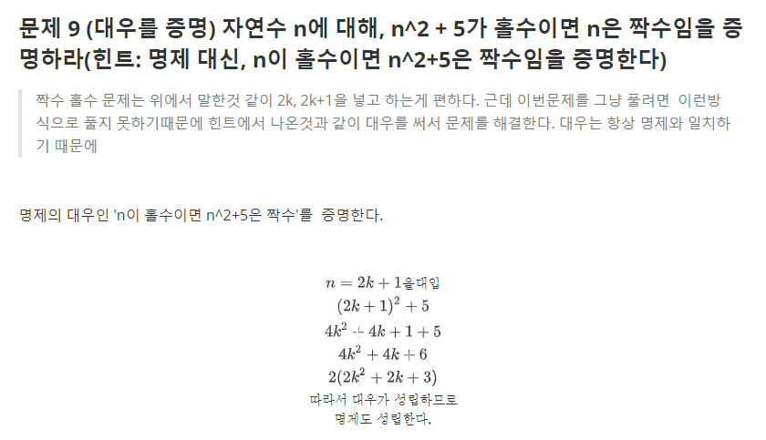


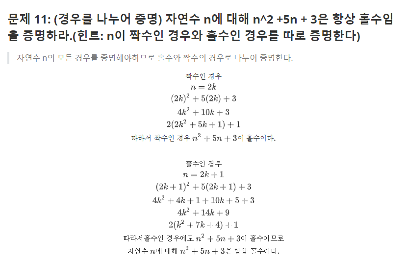


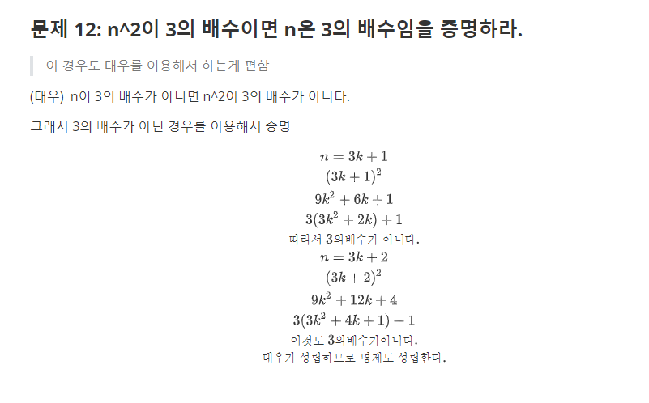


# 2. 수와 표현


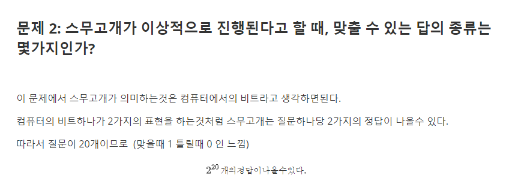


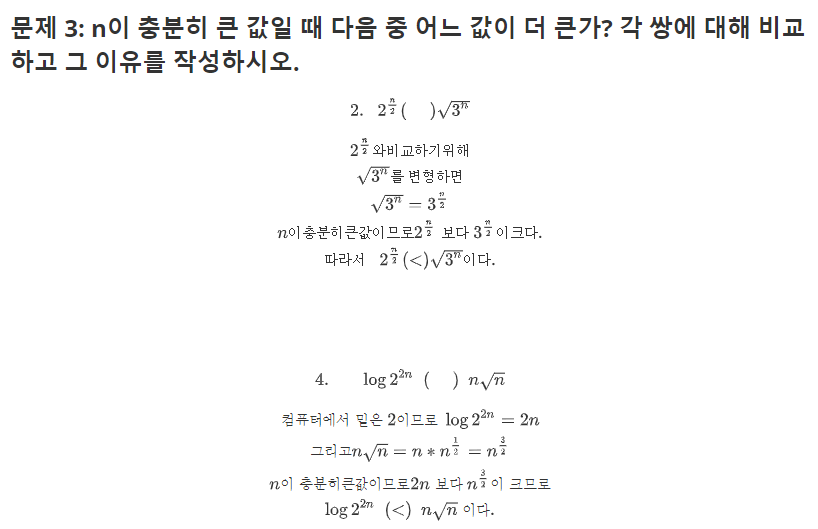


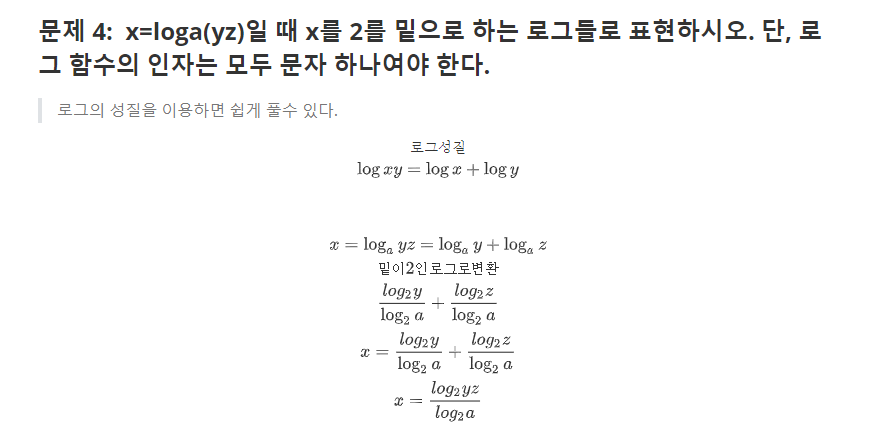


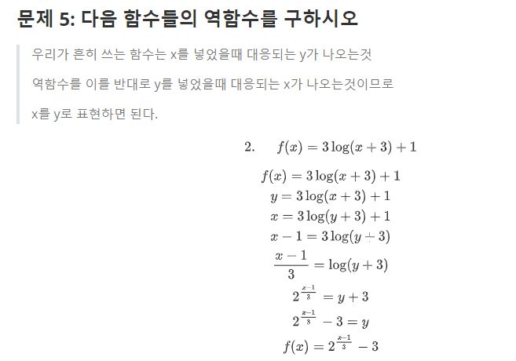


# 3. 집합과 조합론


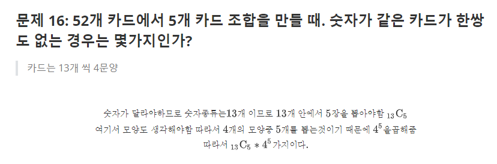


# 4. 기초 수식


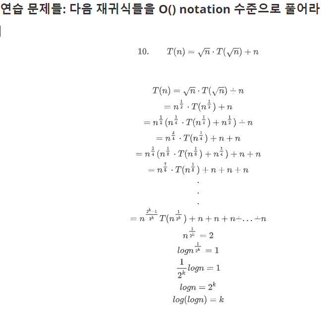


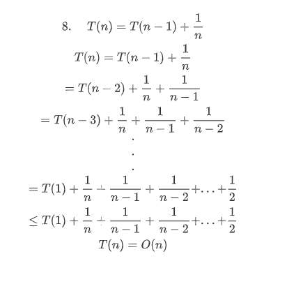


# 5. 재귀

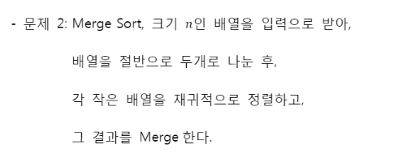

### 


 # 6.  동적 프로그래밍


```python
# A, B행렬이 있다고 생각했을때
for i in range(b):
    for j in range(b):
        for k in range(b):
            A[i,k] * B[k, j]
   
```

